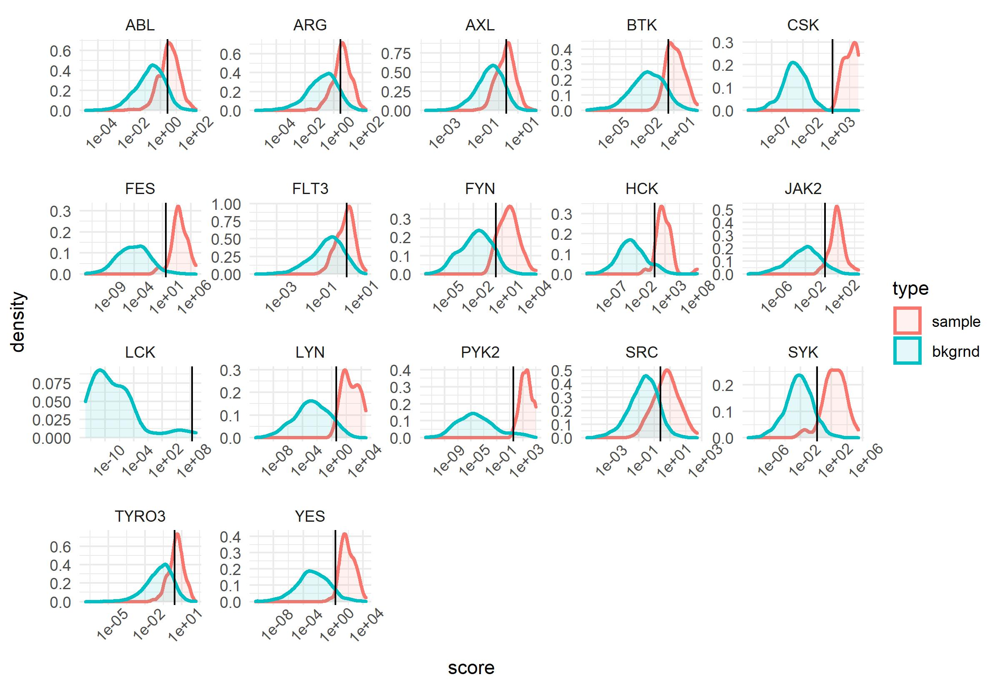
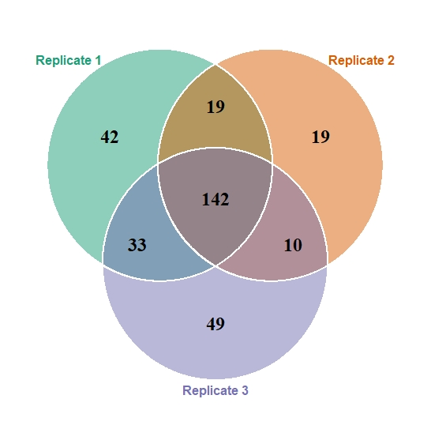
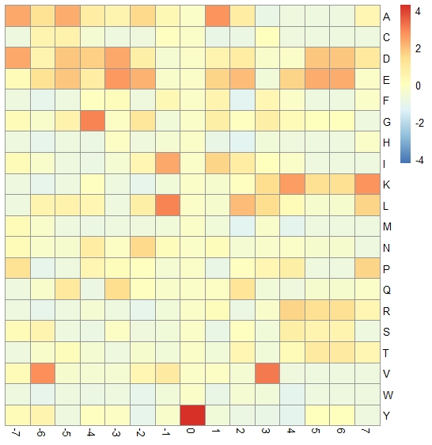
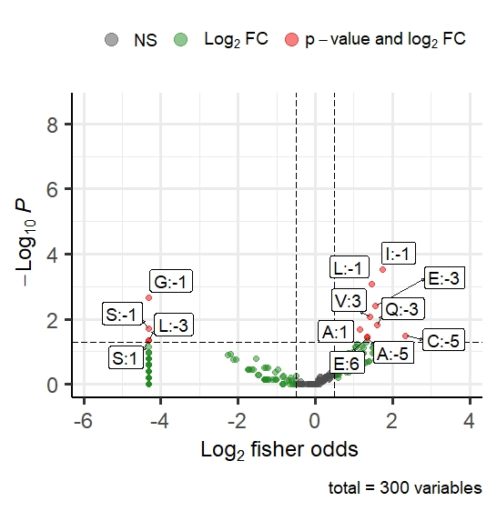
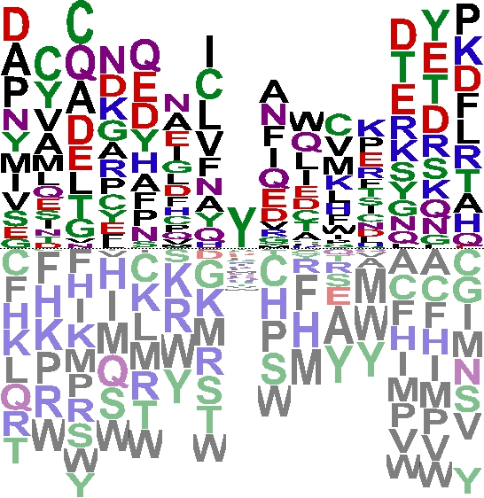

```{r, include = FALSE}
knitr::opts_chunk$set(
  collapse = TRUE,
  comment = "#>"
)
```

# Introduction
KINATEST-ID is a pipeline to design artificial peptide substrates which are 
kinase-specific. This pipeline employs a combination of curated collections of 
known endogenous substrate sequences and data from phosphoproteomics-informed 
kinase assays to develop an in silico peptide library. This library is used for
systematic identification of position-specific amino acid preferences. These 
preferences inform the design of artificial candidate sequences optimized for
kinase-specific performance which can then be characterized *in vitro* or 
*in vivo.*

This vignette demonstrates how the `KINATEST-ID` package to load data, identify 
relevant residues, and generate and score candidate sequences.

# Installing the `KINATEST-ID` package


## Using the `devtools` Package
To install the package from a local source is using the `install_local()` 
function from devtools package:

```{r eval=FALSE}
library(devtools)
install_local("path_to_source/KINATESTID2.tar.gz", dependencies = TRUE)
```

Where, `path_to_source` is absolute path of local source file.

## From Local Zip File
To install the package from the local source file:
```{r eval=FALSE}
install.packages(path_to_source, repos = NULL, type="source")
```

## From R Studio
Another possible way is using RStudio:

1. Go to **Tools**.

2. Go to **Install Packages**.

3. In the *Install From* set it as **Package Archive File (.zip; .tar.gz)**.

4. Then *Browse* to KINATESTID2.tar.gz and click **Install**.

# Loading the `KINATEST-ID` package
Once the package has been installed, it can be loaded using:
```{r results="hide", warning=FALSE, message=FALSE}
library(KINATESTID)
```

```{r results="hide", warning=FALSE, message=FALSE, include=FALSE}
library(kableExtra)
library(magrittr)
```


# Data File Nomenclature
The KINATESTID pipeline accepts both PTM peptide reports generated using the 
KinaMine Galaxy-P workflow (legacy) and the newer Peaks search program
(non-legacy).

## Data File Name
The phosphoproteomics file name should follow this format: 
`KINASE_CONDITION_REPLICATE_*.csv`.

1. `KINASE`: The abbreviation for the kinase used in the enzymatic reaction.
2. `CONDITION`: Accepts two values, `PLUS` indicates an enzyme-treated sample 
                and `MINUS` indicates an untreated (i.e. negative control) sample.
3. `REPLICATE`: Should follow the format of `R*` where `*` is a wildcard 
                representing the replicate number (numeric).
Any additional annotation can be added with an `_` following the replicate number
and will be ignored for file processing.

**Important**: Legacy file names must *also* contain `Substrate` for substrate
               files and `SBF` or `FREQ` for substrate background frequency 
               files.

## Data File Structure
The phosphoproteomics data file should be a .csv and must contain columns for 
each flank position ranging form `-7` to `+7`. Each position column should 
contain 1) an amino acid single letter code or 2) a blank space or `-` to 
indicate an empty value. Other **required** column headers are:

**Non-Legacy**

* `UniProt Identifier`: A column containing the proteome identifier associated
                        with each peptide sequence detected.
* `File Name`: The raw file names from batch processing. File names should 
               follow the same nomenclature listed under Data File Name.
* `AScore`: A column of numerical probability scores used for peptide QC. There 
            is an automatic AScore cutoff of **30** for non-legacy files.
* `Modification Name`: A character column listing the detected PTM type. 
                       Accepted modifications must be listed in the data file
                       `ptm_key`.
* `Amino Acid Letter`: A character column with the single letter code of the 
                       modified amino acid.

**Legacy**

* `Reference`: A column containing the proteome identifier associated with each
               peptide sequence detected. If the column name is different, it 
               can be manually provided in the `import_substrates` function.
               
**General**

* `Species`: A character column identifying the organism the protein is 
             associated with.

Header names `Phosphite` and `Phosphosite` are retained but currently not used.
All other columns are ignored during data import. 

# Quick start using the in-built dataset

## Importing Data Files
Our example uses the `btk_kalip` dataset, which comes as part of the package.
This dataset is the result of a Kinase Assay-Linked Phosphoproteomics (KALIP) 
experiment. It contains a triplicate treatment of K562 cell-derived peptide libraries
with Bruton's tyrosine kinase (BTK). It can be loaded into the workspace using:

```{r eval=TRUE}
path <- system.file("extdata", package = "KINATESTID")
substrates <- import_substrates(path, ptm_type = "Phosphorylation (STY)-Y",
                                legacy =  FALSE, freq = TRUE)
```
The main import function `import_substrates` is a wrapper function with the 
following essential parameters:

* `path`: the directory containing the analyzed phosphoproteomics data.
* `ptm_type`: the post-translational modification to be analyzed and its 
              targeted the amino acid. Currently, only one ptm type can be 
              analyzed at a time. A list of ptm options can be accessed by
              typing `ptm_key`.
* `legacy`: a logical parameter where TRUE is for files generated using the old 
            Galaxy-P KinaMine workflow. Is set to FALSE by default.
* `freq`: a logical parameter where TRUE indicates substrate frequency across 
          technical replicates should be recorded. Is set to TRUE by default.
* `ref_col`: Only applicable to legacy files. A string with the name of the 
             column containing the uniprot identifier information. If none is
             specified, it will search for a `Reference` column automatically.

Part of the processed `btk_kalip` dataset is shown below:

```{r eval=TRUE, echo=FALSE}
kbl(substrates[1:10,]) %>%
  kable_styling(bootstrap_options = c("striped", "hover", "condensed", 
                                      "responsive", font_size = 7), 
                                       full_width = FALSE) %>%
  scroll_box(width = "100%", height = "300px")
```
 
## Filtering Peptide Substrates
The function `bkgrnd_corr` will automatically select peptide sequences
which are present in **maximum** number of *treated* replicates and **minimum**
number of *control* samples. 

```{r eval=FALSE}
uniq_subs <- bkgrnd_corr(substrates)
```

# Generating the Postion-Specific Scoring Matrix (PSSM)

## Generating an In Silico Control Peptide Library
A library of theoretical negative peptide sequences can be generated by 
extracting full protein sequences from UniprotKb and performing an *in silico* 
tryptic digest. There is a pre-loaded digest named `uniprot_tryptic`. 

```{r eval=FALSE, message=FALSE, results="hide"}
output_dir <- getwd()
uniprot <- import_uniprot(uniq_subs, uniprot_tryptic, path = output_dir)
```

Instead of locating the `output_dir` using `getwd()`, a user should provide the
path, e.g. `/path/to/analysis/files`. If there are more than 200 candidate
sequences, the `import_uniprot` function will loop to extract, PTM-center, and 
export the sequences as .csv files before merging and importing the data back 
into R. This is a workaround for the high memory usage of the current
PTM-centering function.

## Fisher Odds Based Position-Specific Scoring Matrix (PSSM)
Fisher exact test is used to calculate the odds ratio and significance of each 
residue across the flanking sequence. This step is performed by the function
`substrate_fisher_test` shown below:

```{r eval=FALSE, message=FALSE, results="hide"}
pssm <- substrate_fisher_test(substrates_dt = uniq_subs, uniprot_dt = uniprot,
                              type = "aa")
```

The output is a list containing two data tables:

* Exact Test P-values
* Fisher Exact Odds

For the -7 to +7 flanking positions of the designated PTM. We can examine both
elements to see if they are consistent in terms of flank order (column) and 
amino acid (row).

```
head(pssm[[1]])
#>          -7         -6         -5        -4          -3        -2          -1 0
#> A 0.1133353 0.19067508 0.03525808 0.3503830 0.567168574 0.1193333 0.802610625 1
#> C 1.0000000 0.08136039 0.03201637 0.5575060 1.000000000 1.0000000 0.114075137 1
#> D 0.0884393 1.00000000 0.12416658 0.1333070 0.058179850 0.6127682 0.123481932 1
#> E 1.0000000 0.75219969 0.42872427 1.0000000 0.003951593 0.2872787 0.321567706 1
#> F 1.0000000 1.00000000 1.00000000 1.0000000 0.738902243 0.6099774 0.414531982 1
#> G 1.0000000 0.71780589 1.00000000 0.1084457 0.310722003 0.6248805 0.002175226 1
#>           1         2          3         4          5          6         7
#> A 0.0203472 0.8001227 0.06960006 0.3591426 0.62425552 0.16218362 0.6856293
#> C 0.6211382 0.5369008 0.09627782 1.0000000 1.00000000 1.00000000 1.0000000
#> D 0.8020600 0.4250087 1.00000000 1.0000000 0.05160001 0.13259150 0.2366401
#> E 0.1728406 0.3739120 0.11975221 0.2909379 0.07398821 0.03663005 0.7230380
#> F 0.2025829 0.3967163 0.52852602 0.6971342 0.62818755 1.00000000 0.4439286
#> G 0.5677780 0.3608784 1.00000000 0.7928085 1.00000000 0.76257455 0.2492259
```


```
head(pssm[[2]])
#>          -7        -6       -5        -4        -3        -2        -1    0
#> A 2.8828155 2.1572349 2.549460 1.5225831 1.2403152 1.8776049 1.1103800 0.05
#> C 0.0500000 4.9003053 5.087841 1.2824186 0.0500000 0.9968278 2.7832186 0.05
#> D 3.2510456 0.7201938 2.125238 2.0293844 2.1342050 1.1892363 0.2086158 0.05
#> E 0.6949790 1.0931315 1.500962 0.9847433 2.9609795 1.4829928 0.3969203 0.05
#> F 0.0500000 0.0500000 0.050000 0.8705247 1.1913971 1.1016606 1.3991439 0.05
#> G 0.6327807 0.4280962 1.021093 1.8267348 0.4156149 1.2813852 0.0500000 0.05
#>           1         2         3         4         5         6         7
#> A 2.2138842 1.1356438 0.0500000 0.3157393 0.0500000 0.0500000 1.1945659
#> C 0.0500000 1.3625518 3.0297666 1.0327090 0.0500000 0.0500000 0.0500000
#> D 1.1181638 1.3625770 0.7080411 0.9878358 2.4884854 2.0427021 1.9153451
#> E 1.7246087 1.4295457 0.2190738 1.5662301 2.3658769 2.5288035 0.3985889
#> F 1.8824513 0.0500000 1.4393602 1.1358747 0.0500000 0.0500000 1.8303415
#> G 0.7040812 0.5152855 0.9154457 0.7101717 0.8433523 0.6190274 0.0500000
```

### Handling Structural Zeros
If an amino acid is observed at a specific flank position in only the background
frequency tables, but not the sample frequency tables, the fisher odds will be 
identically zero. This will also occur if the dataset spans a smaller flank 
around the central ptm (e.g. -4 to +4). This introduces a number of downstream
analysis issues, especially for sequence scoring. There are a number of proposed
workarounds, ranging from Bayesian predictors to introduction of small arbitrary
variable such as a pseudocount. The current implementation uses the simplest 
approach of adding a negligible *pseudo-odds* to structural zeros in the fisher
odds table. If entire columns are empty (e.g. -4 to +4 flanking sequence), they
will not be ignored during peptide scoring.

### Analyzing Amino Acid Properties
A similar analysis can be run based on amino acid *properties* instead of 
individual residues using the `type` "aa_property".

```{r eval=FALSE}
pssm <- substrate_fisher_test(substrates_dt = uniq_subs, uniprot_dt = uniprot,
                              type = "aa_property", 
                              property = "property_chemical")
```

Available amino acid property types are listed in the data file 
`aa_classificiation`.

# Setting Thresholds for Kinase-Specific Peptide Scoring  
The `KINATESTID` package contains the data file `screener_raw` which contains 
kinase-specific preferred substrates curated from the literature and from
phosphoproteomics experiments. The `screener_uniprot` file is the corresponding
protein-matched *in silico* control peptide library.  

The function `multi_screener` takes as inputs 1) the kinase-specific preferred 
substrates file and 2) the protein-matched *in silico* control peptide library.
It also accepts the following parameters:

* `path`: the file path where output data should be saved.
* `method`: Peptide scoring algorithim. Accepts product of odds ratios ("prod"),
            weighted product of odds ratio ("w_prod"), and the sum of log scores
            ("log2_sum").
* `pval_corr`: a logical parameter where TRUE will set all fisher odds with 
               non-significant p-values (> 0.05) to 1. Set to FALSE by default.
* `type`: Accepts either `aa` or `aa_property`. `aa` scores peptides based on 
          fisher odds for each amino acid and `aa_property` scores peptides 
          based on general aa properties.
* `property`: Define amino acid property type to be analyzed. Set to NULL by 
              default.
          

```{r eval=FALSE, warning=FALSE, message=FALSE, results='hide', error=FALSE}
screener <- multi_screener(screener_raw, screener_uniprot, 
                           path = output_dir,
                           method = "prod",
                           pval_corr = FALSE,
                           type = "aa")
```

For each kinase, an optimal threshold will be calculated to separate the 
peptide scores of modified vs control sequences. This is calculated using the
package `cutpointr`. A bootstrap model is used to select an optimal cutpoint to 
maximize *sensitivity* with a minimum *specificity* of **90%**.

The performance of the identified threshold will be printed to the command line, 
as shown here:
```
# > Subgroup: SYK 
# > -------------------------------------------------------------------------------------------------------------------------------------- 
# >   AUC    n n_pos n_neg
# > 0.9717 1100    62  1038
# > 
# > optimal_cutpoint sens_constrain    acc sensitivity specificity tp fn fp  tn
# > 1.363         0.9516 0.9136      0.9516      0.9114 59  3 92 946
# > 
# > Predictor summary: 
# >   Data         Min.           5%      1st Qu.       Median        Mean      3rd Qu.          95%       Max.          SD NAs
# > Overall 1.610584e-09 7.301556e-06 6.458562e-04 9.655520e-03  558.351221 1.715666e-01    66.379461 309355.741 10083.35581   0
# > sample 1.083963e-02 1.619602e+00 3.780979e+01 3.180207e+02 9792.742795 2.727807e+03 26704.369987 309355.741 41711.57507   0
# > bkgrnd 1.610584e-09 6.547317e-06 5.320628e-04 6.864003e-03    6.778699 9.040747e-02     4.834312   1534.229    74.98865   0
# > 
# > Bootstrap summary: 
# >   Variable Min.   5% 1st Qu. Median Mean 3rd Qu.  95% Max.   SD NAs
# > optimal_cutpoint 0.92 1.05    1.26   1.62 1.79    2.10 3.10 3.64 0.68   0
# > AUC_b 0.94 0.95    0.96   0.97 0.97    0.98 0.98 0.99 0.01   0
# > AUC_oob 0.94 0.95    0.96   0.97 0.97    0.98 0.99 0.99 0.01   0
# > sens_constrain_b 0.85 0.89    0.92   0.95 0.94    0.97 0.98 1.00 0.03   0
# > sens_constrain_oob 0.76 0.82    0.90   0.93 0.93    0.96 1.00 1.00 0.06   0
# > acc_b 0.90 0.91    0.91   0.92 0.92    0.93 0.94 0.95 0.01   0
# > acc_oob 0.88 0.89    0.91   0.92 0.92    0.93 0.94 0.94 0.01   0
# > sensitivity_b 0.85 0.89    0.92   0.95 0.94    0.97 0.98 1.00 0.03   0
# > sensitivity_oob 0.76 0.82    0.90   0.93 0.93    0.96 1.00 1.00 0.06   0
# > specificity_b 0.90 0.91    0.91   0.92 0.92    0.93 0.94 0.94 0.01   0
# > specificity_oob 0.88 0.89    0.91   0.92 0.92    0.93 0.94 0.95 0.02   0
# > cohens_kappa_b 0.46 0.49    0.51   0.53 0.53    0.54 0.62 0.64 0.04   0
# > cohens_kappa_oob 0.39 0.43    0.49   0.51 0.52    0.55 0.59 0.65 0.05   0

```
The function `multi_screener` will automatically output a graph showing the 
distribution of peptide scores for each kinase, with the selected threshold 
marked with a vertical line.

```{r, echo=FALSE, out.width="100%"}

```

# Generating Candidate Artificial Peptide Sequences

Identification of kinase-preferred amino acids, generation of artificial peptide
substrates, and *in silico* scoring for potential efficiency and specificity are
wrapped under the `generate_substrates` function. 

```{r eval=FALSE, warning=FALSE, message=FALSE, error=FALSE, results='hide'}
candidates <- generate_substrates(pssm, uniprot, screener, 
                                  target_kinase = "BTK",
                                  method = "prod",
                                  screening_kinase = "ALL",
                                  n_hits = 10)

```

* `target_kinase`: Input is the abbreviation for the kinase the substrate 
                   is to be optimized for. 
* `screening_kinase`: Input is a vector of kinases to optimize against. Setting
                      `screening_kinase = "ALL"` will screen against every kinase
                      in the existing screener file.

The output is a list containing four elements:

1. A list of amino acids used for permutation when creating candiate substrates.
    + `sig_pos`: The number of residues which were statistically significant 
                 (p <= 0.05) at that position
2. *In silico* screen for activity against panel of kinases indicated by the 
   user.
    + `active`: If the substrate score is > than the threshold, it will 
                be marked as active for that enzyme.
    + `perf`: Predicted performance is split into "low", "medium", and "high" 
              based on the peptide scoring falling above the 10th, 50th or 90th 
              quantile, respectively. 
    + `n_active`: The total number of kinases marked as "active" based on the 
                  criteria above.
3. Table of candidate peptide substrates in order of  raw score.
4. The top `n_hits` substrates scored to be active for `target_kinase and the 
   lowest substrate scores for all other kinases in the screener panel.

An example output is shown below:

```
#> $candidate_aa
#>    amino_acid flank_pos fisher_odds fisher_pval barcode sig_pos
#> 1:          A        -7    2.882816  0.11333533    A:-7       0
#> 2:          A        -6    2.157235  0.19067508    A:-6       0
#> 3:          A        -5    2.549460  0.03525808    A:-5       2
#> 4:          A        -2    1.877605  0.11933330    A:-2       0
#> 5:          A         1    2.213884  0.02034720     A:1       2
#> 6:          C        -5    5.087841  0.03201637    C:-5       2
#> 
#> [[2]]
#>    kinase active     perf        score  threshold substrate_barcode n_active
#> 1:    ABL   TRUE   medium    13.350626   2.719099                 1       10
#> 2:    ARG   TRUE   medium     6.430851   2.903400                 1       10
#> 3:    AXL   TRUE     high    13.801509   2.428566                 1       10
#> 4:    BTK   TRUE     high 25533.582387   3.111091                 1       10
#> 5:    CSK  FALSE inactive     1.365685 934.714727                 1       10
#> 6:    FES   TRUE   medium  3316.614922  15.360549                 1       10
#> 
#> [[3]]
#>    substrate_barcode raw_score -7 -6 -5 -4 -3 -2 -1 0 1 2 3 4 5 6 7 n_active
#> 1:                 1 118551.71  A  A  A  N  D  A  I Y A D V K D E D       10
#> 2:                 2  44676.03  I  A  A  N  D  A  I Y A D V K D E D        9
#> 3:                 3 108698.54  P  A  A  N  D  A  I Y A D V K D E D        8
#> 4:                 4 236588.21  A  A  C  N  D  A  I Y A D V K D E D        9
#> 5:                 5  89157.89  I  A  C  N  D  A  I Y A D V K D E D        5
#> 6:                 6 216924.68  P  A  C  N  D  A  I Y A D V K D E D        9
#> 
#> $top_hits
#>    substrate_barcode raw_score -7 -6 -5 -4 -3 -2 -1 0 1 2 3 4 5 6 7 n_active
#> 1:             12308  26321.37  I  A  C  R  Q  A  L Y D E V K D E L        1
#> 2:             12605  37179.56  I  A  C  R  E  A  L Y D L V K D E L        1
#> 3:             12632  38214.22  I  A  C  R  Q  A  L Y D L V K D E L        1
#> 4:             12929  22641.74  I  A  C  R  E  A  L Y D T V K D E L        1
#> 5:             12938  46491.21  I  A  C  N  Q  A  L Y D T V K D E L        1
#> 6:             16196  25024.51  I  A  C  R  Q  A  L Y D E V K E E L        1
```
# Data Visualization
## `peptide_intersect`: Peptide Commonality Across Replicates
To better understand the distribution of peptides detected, there are some 
simple analyses pre-built into `KINATEST-ID`. The first is looking at overlap
in detected peptides across technical replicates. 

```{r eval=FALSE, warning=FALSE, message=FALSE, results='hide'}
venn <- peptide_intersect(substrates)[[1]]
```

```{r, echo = FALSE}

```

The `peptide_intersect` function output is a list of two elements:

1. A ggplot object containing the venn diagram for each technical replicate.
   The number of sample sets is detected automatically (up to three replicates 
   are currently supported).

2. A nested list containing the `substrate_barcode` information for each overlap
   set.

## `substrates_heatmap`: Heatmap of PSSM Data
Another visualization option is to view the position-specific frequency of each
amino acid using a heatmap.
```{r eval=FALSE, warning=FALSE, message=FALSE, results='hide'}
heatmap <- substrates_heatmap(uniq_subs, scramble = FALSE, seed = 123)
```

The `substrates_heatmap` function accepts the following arguments:

* `scramble`: A logical value indicating whether the rows should be randomly
              shuffled. Set to FALSE by default.

* `seed`: An arbitrary value to generate reproducible random numbers. Only 
          needed in cases where `scramble` is set to TRUE.
          
```{r, echo = FALSE}

```

## `pssm_volcano`: Create Volcano Plot
A volcano plot can be generated for a more general view of differential residue
"preferences".

```{r eval=FALSE, warning=FALSE, message=FALSE, results='hide'}
volcano <- pssm_volcano(pssm, odds_cutoff = 0.5, pval_cutoff = 0.05)
volcano
```

```{r, echo = FALSE}

```

The `pssm_volcano` function takes the following parameters:

* `odds_cutoff`: The log 2 odds ratio threshold for being considered significant.
                 If not specified it is set to 0.5 automatically.
                 
* `pval_cutoff`: The threshold p-value to be considered significant. If not
                 specified it is set to 0.05 automatically.
                 
These analyses and other quality control plots are contained in the wrapper
function `substrates_qc`.

```{r eval=FALSE}
qc <- substrates_qc(substrates, uniprot, output_dir)
```

# Other Functions
## Motif Generation 
The generated PSSM can be readily used to generate motif or affinity logos for
presentation. The following is an example using the package `motifStack`, but
many similar R packages exist.

```{r eval=FALSE, warning=FALSE, message=FALSE, results='hide'}
library(motifStack)
motif <- new("psam", mat= pssm[[2]], name = "Affinity Logo", 
             color = colorset(alphabet = "AA", colorScheme = "chemistry"))
plot(motif)
```

```{r, echo = FALSE}

```

## `multi_candidate_screener`: Scoring Existing Peptide Sequences
Existing sequences can be re-scored using the `KINATEST-ID` algorithim as long
as the input .csv file has a similar `-7` to `+7` input structure:

```{r eval=FALSE}
old_peptides <- fread("path_to_source/data_file.csv")
```

```
# 
#   substrate_barcode kinase   -7   -6   -5 -4 -3 -2 -1 0 1 2 3 4    5    6    7
#1:                U6    ALL <NA> <NA> <NA>  D  E  P  I Y D T V E <NA> <NA> <NA>
#2:                U3    ALL <NA> <NA> <NA>  D  E  D  I Y G T P E <NA> <NA> <NA>
#3:                U7    ALL <NA> <NA> <NA>  E  D  D  V Y D S V P <NA> <NA> <NA>
#4:                U2    ALL <NA> <NA> <NA>  E  D  P  I Y V T L E <NA> <NA> <NA>
#5:                U1    ALL <NA> <NA> <NA>  E  D  D  E Y Y V T P    E <NA> <NA>
#6:                U4    ALL <NA> <NA> <NA>  D  E  P  I Y D T P E <NA> <NA> <NA>
#7:                U5    ALL <NA> <NA> <NA>  D  E  A  I Y A T V A <NA> <NA> <NA>
#8:                U8    ALL <NA> <NA> <NA>  E  D  D  E Y I S P E <NA> <NA> <NA>
#9:                U9    ALL <NA> <NA> <NA>  E  D  D  E Y A T P E <NA> <NA> <NA>
```
Mutate the input data to long format and create a new `barcode` column which
combines flank position and amino acid information. 

```{r eval=FALSE}
old_peptides <- data.table(reshape2::melt(old_peptides,
                                          id.vars = c("substrate_barcode", "kinase"), 
                                          value.name = "amino_acid", 
                                          variable.name = c("flank_pos")))
old_peptides[, barcode:= paste0(amino_acid, ":", flank_pos)]
old_peptides <- na.omit(old_peptides)
```

```
head(old_peptides)
#    substrate_barcode kinase flank_pos amino_acid barcode
# 1:                U6    ALL        -4          D    D:-4
# 2:                U3    ALL        -4          D    D:-4
# 3:                U7    ALL        -4          E    E:-4
# 4:                U2    ALL        -4          E    E:-4
# 5:                U1    ALL        -4          E    E:-4
# 6:                U4    ALL        -4          D    D:-4
```
```{r eval=FALSE}
scores <- multi_candidate_screener(screener, old_peptides, "ALL", "prod", FALSE)
head(scores)
#        kinase active     perf      score   cutpoint substrate_barcode n_active
#     1:    ABL   TRUE   medium   4.686755   2.696951                U6       11
#     2:    ARG   TRUE   medium   7.352788   2.928542                U6       11
#     3:    AXL   TRUE     high  17.898059   2.401886                U6       11
#     4:    BTK   TRUE     high 162.656945   3.214976                U6       11
#     5:    CSK  FALSE inactive  96.024821 599.754951                U6       11
```

## Scaling Raw Peptide Scores
Raw peptide scores can be translated to an absolute scale based on the range of
peptide scores found in the screener file provided. `norm_scores` will scale
raw peptide scores based on the following equation:

$$
score_{scaled} = \frac{log(score_{raw}) - log(score_{min})}{(log(score_{max}) - 
log(score_{min})}*100
$$
Where $score_{scaled}$ is the converted score, $score_{raw}$ is the raw peptide
score, $score_{min}$ is the minimum peptide score observed for a kinase 
substrate and $score_{max}$ is the maximum.

```{r eval=FALSE}
normscores <- norm_scores(scores, screener)
lapply(normscores, head)
# [[1]]
#   substrate_barcode ABL ARG AXL BTK CSK FES FLT3 FYN HCK JAK2 LCK LYN PYK2 SRC SYK TYRO3 YES
# 1                U1  75  75  83  71  51  59   96  53  54   86  46  68   68  79  70    82  83
# 2                U2  77  79  86  84  75  76   90  63  62   74  38  79   81  79  75    82  82
# 3                U3  89  91  81  86  73  65   84  69  60   58  37  81   83  84  79    78  91
# 4                U4  82  85  86  88  76  74   76  70  60   54  45  79   84  84  79    78  90
# 5                U5  88  90  87  91  62  84   97  72  64   42  44  84   72  67  70    79  74
# 6                U6  78  82  88  91  72  86   79  74  60   54  36  80   82  83  78    76  90
# 
# [[2]]
# kinase norm_thresholds
# 1:    ABL              74
# 2:    ARG              77
# 3:    AXL              73
# 4:    BTK              74
# 5:    CSK              76
# 6:    FES              69
```

The `norm_scores` function output is a list of two elements:

1. Converted $score_{scaled}$ for each substrate provided across all kinases 
   listed in the screener file.

2. The corresponding scaled thresholds for each kinase $cutpoint_{scaled}$.

# Session Info
```{r}
sessionInfo()
```

